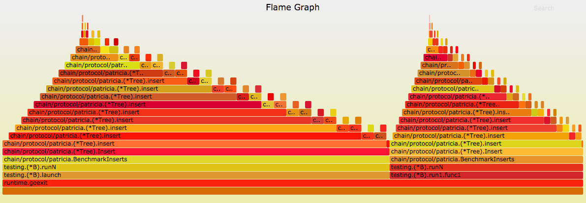

# Profiling 

## Memory Profiling

To memory profile part of Chain Core, first create a benchmark using the `testing` package. (Benchmarks take a `*testing.B` instead of a `*testing.T` and have names that begin with `Benchmark`.)

The run `go test` inside that package with the following flags: 

```
go test -run=XXX -bench=. -benchmem -benchtime=5s -memprofile mem.out -memprofilerate=1
```

The `run` flag runs tests matching a regular expression. `run=XXX` is an arbitrary regex that won't match anything. 

The `bench` flag runs all benchmarks matching a regular expression. `bench=.` runs all benchmarks. 

The `benchmem` flag prints memory allocation stats to the command line.

The `benchtime` flag specifies how long this benchmark should run. `benchtime=5s` will rerun the benchmark until 5 seconds have elapsed. 

The `memprofile` flag writes a memory profile to the file after all tests have passed. It also writes a test binary, like `example.test` (for a file called `example_test.go`). 

The `memprofilerate` flag enables more precise memory profiles. `memprofilerate=1` profiles all memory allocations. 

So ultimately this creates a profile at `mem.out`, and prints something like this to the command line: 

```
BenchmarkInserts-4              3    2432739751 ns/op    140052936 B/op  678693 allocs/op
```

### Flame Graphs

[Torch](https://github.com/uber/go-torch) is a tool that takes test binaries and memory profiles and generates flame graphs that look like this: 



To use torch, run 

```
go-torch --alloc_objects example.test mem.out
```

where `example.test` is the test binary and `mem.out` is the profile created by `go test`. This creates `torch.svg.`


